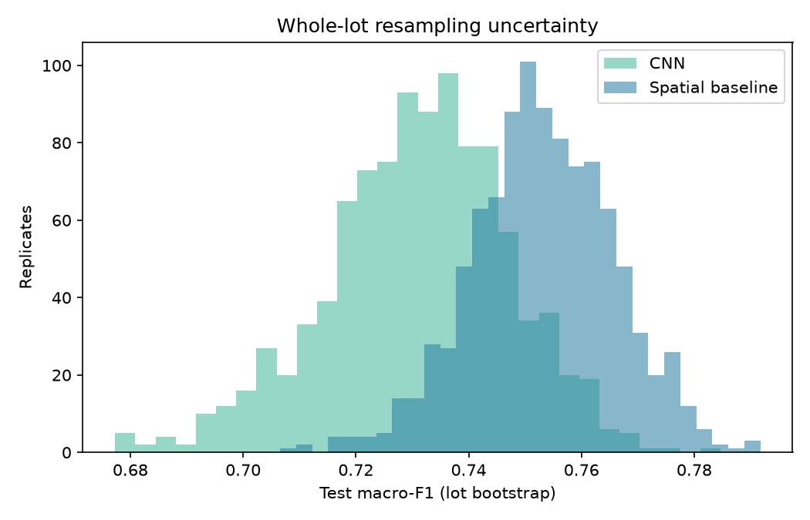

# 모델 입력 중복과 lot 단위 성능 불확실성

## 무엇을 고쳤나

원본 연구는 원본 map SHA-256으로 분할 간 완전 중복을 제거했지만, CNN이 실제 보는 **48×48 최근접 리사이즈 입력**의 충돌은 확인하지 않았다. 새 평가에서는 원본 hash와 변환 입력 hash를 모두 비교해 train/validation/test 간 중복 입력을 제거하고 분류 모델을 다시 학습했다.

| 평가 | validation 제거 | test 제거 | test 결함 wafer |
| :--- | ---: | ---: | ---: |
| 원본 map hash만 | 15 | 23 | 3,637 |
| 원본+48×48 입력 hash | 17 | 34 | 3,626 |

추가 제거 2장/11장은 서로 다른 원본 map이 모델 입력에서는 같아지는 사례다. 전체 데이터나 다른 리사이즈 크기의 유사 중복까지 제거했다는 뜻은 아니다.

## 같은 설정으로 재학습한 test 결과

| 모델 | 원본 연구 macro-F1 | 입력 중복 제거 후 macro-F1 | lot bootstrap 95% 구간 |
| :--- | ---: | ---: | ---: |
| CNN | 0.734 | 0.735 | 0.696–0.761 |
| 공간 특징 기준선 | 0.755 | 0.755 | 0.728–0.777 |

같은 test lot을 재표본추출한 **기준선 − CNN macro-F1** 차이는 +0.020, 95% 백분위 구간은 **-0.004–+0.054**이다. Bootstrap 1,000회, 시드 42, test lot 1,195개. `Near-full`이 빠진 재표본 비율은 0.0%다.

[재표본별 수치](lot_bootstrap_samples.csv) · [재학습 세부 지표](step6_metrics.json)

## 해석 경계

- 이 구간은 **관찰된 test lot을 재표본추출**한 불확실성이다. 새 장비·공정·시점으로의 일반화 구간은 아니다.
- 같은 분할 안의 유사 중복은 남아 있고, 48×48 hash는 완전 동일 입력만 잡는다. 구조적으로 비슷하지만 픽셀이 조금 다른 wafer는 별도 검사해야 한다.
- CNN epoch는 validation macro-F1로 선택했고 test는 최종 평가에만 사용했다. 입력 중복 제거 후 모델을 다시 학습했으므로 단순히 test 행만 삭제한 결과가 아니다.
