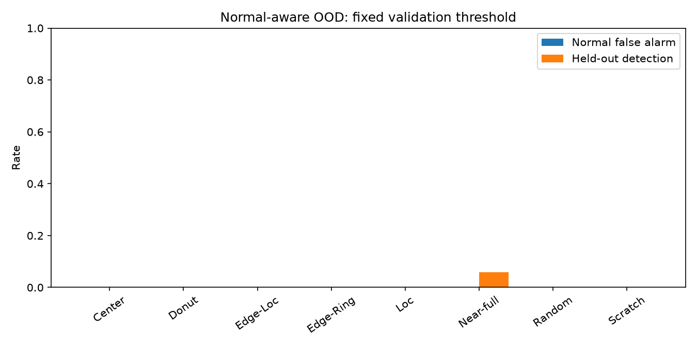

# 정상 wafer를 포함한 보류 유형 OOD 재평가

기존 7단계는 `none`을 제외한 결함 라벨끼리만 알려진 유형/보류 유형을 비교했다. 이 실험은 `none`을 **알려진 정상 유형**으로 train·validation·test에 포함해 정상 wafer 오경보를 따로 측정한다. `unlabeled`는 정답이 없어 제외한다.

## 평가 설계

- 각 결함 유형을 하나씩 학습에서 빼고 나머지 7종과 `none`으로 train에 적합했다. 결측 대체·표준화·로지스틱 회귀 및 Mahalanobis 중심·공분산은 train만 사용한다.
- 원래 거리의 `pooled` 임계값은 알려진 유형 validation 전체의 95백분위수다. `per_class_guard`는 유형별 95백분위수 중 최댓값이다. 추가한 `class_scaled_mahalanobis`는 각 중심까지의 거리를 해당 유형 validation의 95백분위 거리로 나누고 최솟값을 취한다. 임계값 1은 validation에서 정했다. 보류 유형 validation과 test는 설정에 쓰지 않았다.
- 원본 map SHA-256으로 분할 간 완전 중복을 제거했다. Validation 602장, test 850장 제거. 동일 lot은 분할 간 겹치지 않는다.
- 평가에는 수율에 대응하는 fail rate와 공간 특징 11개를 사용한다. 기본 거리·확신도는 7단계 정의를 유지했고 유형별 거리 보정을 새로 시험했다.

## 결과

| 방법 | 임계값 정책 | 평균 AUROC | 평균 AUPR | 평균 FPR@95% TPR | 정상 오경보율 | 알려진 결함 오경보율 | 보류 유형 탐지율 |
| :--- | :--- | ---: | ---: | ---: | ---: | ---: | ---: |
| class_scaled_mahalanobis | class_radius_95 | 0.450 | 0.128 | 0.859 | 0.0% | 0.0% | 0.7% |
| mahalanobis | per_class_guard | 0.898 | 0.244 | 0.350 | 0.0% | 0.0% | 0.0% |
| mahalanobis | pooled | 0.898 | 0.244 | 0.350 | 0.8% | 28.6% | 66.7% |
| one_minus_max_softmax | per_class_guard | 0.499 | 0.029 | 0.911 | 2.0% | 1.8% | 3.0% |
| one_minus_max_softmax | pooled | 0.499 | 0.029 | 0.911 | 5.1% | 6.2% | 8.4% |

**해석:** 기본 Mahalanobis의 pooled 임계값은 보류 유형을 비교적 많이 잡지만 알려진 결함 오경보가 높다. 유형별 최대 임계값과 거리 보정은 오경보를 거의 없애는 대신 보류 유형도 거의 탐지하지 못했다. 따라서 이 자료에서 안전한 신규 패턴 경보기를 확보했다고 볼 수 없다. AUROC와 임계값 적용 탐지율은 서로 다른 질문에 답한다.

다음 표는 유형별 거리 보정 결과다.

| 보류 유형 | 정상 test 장수 | 보류 test 장수 | 보정 거리 AUROC | 정상 오경보율 | 보류 탐지율 |
| :--- | ---: | ---: | ---: | ---: | ---: |
| Center | 21,745 | 626 | 0.485 | 0.0% | 0.0% |
| Donut | 21,745 | 87 | 0.623 | 0.0% | 0.0% |
| Edge-Loc | 21,745 | 788 | 0.371 | 0.0% | 0.0% |
| Edge-Ring | 21,745 | 1,246 | 0.473 | 0.0% | 0.0% |
| Loc | 21,745 | 555 | 0.351 | 0.0% | 0.0% |
| Near-full | 21,745 | 17 | 1.000 | 0.0% | 5.9% |
| Random | 21,745 | 126 | 0.030 | 0.0% | 0.0% |
| Scratch | 21,745 | 192 | 0.263 | 0.0% | 0.0% |

자세한 임계값·표본 수·세 방법 지표는 [CSV](ood_with_normal.csv)에 있다. 기존 7단계와는 알려진 유형 구성·중복 제거 대상이 달라 숫자를 직접 같은 모집단의 전후 개선으로 해석하면 안 된다.

## 남는 한계

- `none`은 공개 데이터의 라벨이지 실제 제조 현장의 정상 판정 절차를 대체하지 않는다. 미라벨 wafer, 외부 라인·장비·시점의 오경보는 검증하지 못했다.
- 유형별 거리 보정과 guard 모두 test에서 유형별 오경보 5%를 보장하지 않는다. 희귀 유형의 백분위 추정은 불안정하다. 두 임계값 정책이 보류 탐지를 없애는 경우도 결과에 그대로 표시했다.
- 원본 map의 완전 중복은 제거했지만 유사 중복은 남는다. 특정 보류 유형의 test 수가 적어 불확실성이 크다.
- OOD 점수는 원인 판정이 아니며 공정·장비 이력과 결합한 엔지니어 검토가 필요하다.
